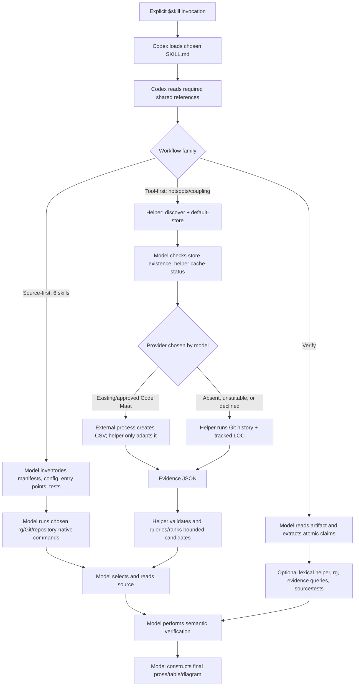

# Codebase Intelligence Runtime Audit (historical V2)

> Historical record: this document describes the superseded V2 implementation and is not a description of the current V3 runtime. For current behavior, see `README.md`, `SPEC-V3.md`, and `docs/validation.md`.

## Executive finding

The V2 implementation was primarily a prompt package, not an analysis engine.

Seven skills—onboarding, tutorial, architecture, trace, deep-dive, change, and verify—have no deterministic orchestrator. After invocation, Codex reads Markdown instructions and independently chooses searches, files, symbols, tests, stopping points, and final wording. Their quality therefore depends mainly on model judgment.

Hotspots and coupling add a real deterministic layer: a local Python/Git helper can discover tools, generate historical observations, normalize Code Maat CSV, validate/cache evidence, and rank/filter candidates. Even for those skills, Codex must orchestrate every command, handle failures, choose what source to inspect, interpret results, verify semantic claims, and write the report.

This audit covers the clean checkout at commit `49327bea82fe7b5a4daf6d818aac2d3fcfbf0faa`.

## Common invocation behavior

All nine skills are explicit-only; their agent configurations set `allow_implicit_invocation: false`. Invocation causes the platform to load the chosen `SKILL.md`; it does not execute the Python helper.

Every skill then instructs Codex to read `shared/references/core.md`, which requires:

- resolving the repository root and reading applicable `AGENTS.md`;
- treating the repository as read-only;
- using `rg`, manifests, Git, and repository-native tools;
- maintaining an evidence ledger in model context;
- reading `shared/references/verification.md` before reporting.

This repository has no `AGENTS.md`.

Reference loading by skill is:

| Skill | Directly loaded references | Indirect final reference |
|---|---|---|
| Onboarding, architecture, trace, deep-dive, change | `core.md`, `source-first.md` | `verification.md` through core |
| Tutorial | Above plus `tutorial-workflow.md` | `verification.md` |
| Hotspots, coupling | `core.md`, `tool-first.md`, `evidence-contract.md`, `tool-providers.md` | `verification.md` |
| Verify | `core.md`, `verification.md`; `evidence-contract.md` only for metric claims | None additional |

No component enforces that Codex follows these instructions. There is no runtime state machine, source selector, context builder, report generator, or stopping algorithm.

## Concrete deterministic behavior on this repository

Running discovery produced:

- ecosystems: `python` and `c-cpp`;
- three Python files;
- `Makefile` classified as a C/C++ manifest;
- Git and `rg` found;
- Code Maat not checked at all.

The C/C++ classification is a false positive caused by treating any `Makefile` as a C/C++ manifest. Code Maat is absent from the tool-probe list.

The default cache location is:

```text
/tmp/codebase-intelligence/652d848b88f981c03762/evidence-v1.json
```

That file did not exist. Calling `cache-status` did not return a structured cache miss; it exited with code 2 and “cannot read … No such file or directory.” Codex must pre-check existence or interpret the error.

The Git fallback on the current repository produced:

- 37 change-frequency observations;
- 37 churn observations;
- 37 ownership observations;
- 37 physical-LOC observations;
- zero temporal-coupling observations;
- no limitation warning, despite only four commits.

The absence of coupling is explained by implementation rules: pairs need at least two shared commits, while changesets above 30 files are excluded from pair generation. The initial 37-file commit is excluded and remaining co-changes do not reach two shared commits. The helper only declares history insufficient below two commits.

Current hotspot leaders were `README.md`, the Python helper, and its tests. That reflects four repository-construction commits, not demonstrated maintenance difficulty.

## Per-skill runtime traces

### 1. Codebase Onboarding

Representative invocation:

```text
$codebase-onboarding Orient me to this repository.
```

Immediately after invocation, Codex loads `skills/codebase-onboarding/SKILL.md`, `core.md`, `source-first.md`, and eventually `verification.md`.

There is no mandated helper command. Codex is expected—but not programmatically forced—to inventory the top level, manifests, plugin metadata, entry points, tests, and development commands. On this repository that should lead it toward:

- `plugin.json` and `.codex-plugin/plugin.json`;
- the nine `SKILL.md` files and agent YAML files;
- shared references;
- `shared/scripts/codebase_intelligence.py`;
- `tests/test_infrastructure.py`;
- `Makefile`, README, and validation script.

Candidate selection is entirely model judgment. “Entry point,” “core abstraction,” “representative flow,” and “common change location” have no deterministic definition.

The analysis expands when Codex follows imports, registrations, configuration, tests, documentation contradictions, or unclear boundaries. It stops when the model considers the requested onboarding depth satisfied. The only scope control is prose telling it not to make a file inventory and to defer deeper work.

Evidence enters context as command output, selected source excerpts, test excerpts, and the model’s internal evidence ledger. Nothing serializes or bounds that ledger.

Verification consists of repeated `rg`/file inspection or optional use of the lexical reference helper, followed by model review of semantic claims. The final answer is model-written using the sections specified by the skill.

Gap: the implementation provides no automatic repository map, entry-point detector, reading-order algorithm, or completeness check.

### 2. Codebase Tutorial

Representative invocation:

```text
$codebase-tutorial Teach me how this repository works.
```

Codex loads the common source-first references plus `skills/codebase-tutorial/references/tutorial-workflow.md`.

The model must choose approximately five to ten abstractions. For this repository plausible selections are skill entry points, source-first analysis, tool-first analysis, Evidence v1, Git evidence generation, Code Maat adaptation, cache/provenance, and verification. That selection is not produced by code.

For each abstraction, Codex is instructed to retain a working record, inspect a few relevant source files and symbols, establish relationships, and arrange chapters pedagogically. The “record” exists only in model context unless Codex voluntarily writes scratch files. No concept indexer, dependency sorter, excerpt validator, chapter generator, or internal-link checker is bundled.

Analysis expands when a concept’s collaborators or prerequisites must be understood. It stops around the model-chosen concept set and chapter depth. The five-to-ten limit is guidance, not enforcement.

Verification is again model-driven: every tutorial edge and excerpt should be checked against source or tests. If output files were requested, Codex must construct and validate them itself. Otherwise the final tutorial appears in chat.

Gap: the elaborate abstraction and chapter workflow has no supporting implementation beyond instructions.

### 3. Codebase Architecture

Representative invocation:

```text
$codebase-architecture Map this system’s architecture.
```

After loading source-first references, Codex examines manifests, deployment/runtime boundaries, registrations, configuration, state, integrations, tests, and representative flows.

On this repository, the actual architectural boundaries must be inferred from:

- Codex/plugin installation metadata;
- nine independent prompt entry points;
- shared Markdown policy;
- the local helper CLI;
- Git and optional external providers;
- developer-time tests and validation.

No dependency analyzer is automatically run. `static_dependency` exists as an allowed evidence type, but the helper never produces one. If a configured project-native analyzer existed, Codex could choose to run it; otherwise it uses `rg` and direct inspection.

Component and relationship selection, boundary inference, flow selection, and diagram construction are model judgment. Analysis expands through communications, state, external integrations, or documentation contradictions and stops when the model considers the major architecture covered.

Every diagram edge is supposed to be verified, but there is no diagram parser or edge-verification implementation. The final architecture narrative and Mermaid are generated entirely by the model.

Gap: the skill promises evidence-backed architectural structure, but all semantic architecture discovery and verification are manual model work.

### 4. Codebase Trace

A bare default invocation says “follow this behavior,” but does not identify a behavior. Without surrounding context, the skill must ask what to trace.

Concrete invocation:

```text
$codebase-trace Trace Git evidence cache validation end to end.
```

Codex loads the source-first references, then searches for the trigger. On this repository the concrete path is:

```text
CLI parser
→ main()
→ cache_status()
→ load_json()/validate_store()
→ repo_metadata()
→ expected_cache_provenance()
→ field comparison
→ JSON result and exit status
```

The relevant definitions are in `shared/scripts/codebase_intelligence.py` and its tests.

No trace is generated automatically. Codex must locate the trigger, follow calls, inspect error paths and tests, and record `from → mechanism → to` hops. Candidate selection is bounded by the named behavior but otherwise uses model judgment.

The trace expands when an encountered branch affects the requested behavior—for example, Git versus Code Maat provenance, malformed stores, or dirty-tree invalidation. It stops at the emitted result and relevant error alternatives rather than broadening into architecture.

Verification means reopening each definition/caller and relevant test. `verify-references` could confirm symbol text but cannot prove call edges. The model creates the sequence diagram and explanatory output.

Gap: there is no call-graph, registration tracer, runtime instrumentation, or automatic hop verifier.

### 5. Codebase Deep Dive

A bare default invocation refers to “this subsystem” and is unusable without surrounding context.

Concrete invocation:

```text
$codebase-deep-dive Explain the evidence/cache subsystem.
```

Codex loads source-first references, defines a boundary, and then inspects the helper’s provenance construction, store validation, cache comparison, query/ranking consumers, tests, and shared evidence documentation.

The public boundary, state, invariants, callers, lifecycle, failure handling, concurrency relevance, and extension points are all identified by model reasoning. No deterministic subsystem boundary or caller set is produced.

Expansion is allowed through verified collaborators only. For this subject, it should reach Git metadata, working-tree fingerprinting, Code Maat input hashing, validators, query/ranking, and tests, but not unrelated tutorial or marketplace behavior. It stops when the subject checklist is covered.

The final mental model, lifecycle, boundary map, and extension guidance are model-authored and semantically verified through inspection.

Gap: “deep” and “bounded” are qualitative model decisions; the implementation supplies no coverage measure or subsystem model.

### 6. Codebase Change

A bare default invocation says “this change” without identifying one, so it requires existing conversational context or a clarification.

Concrete invocation:

```text
$codebase-change Plan adding another historical evidence provider.
```

Codex loads source-first references, restates the desired behavior, and traces current provider handling. Expected direct inspection includes:

- adapter and CLI branches in `codebase_intelligence.py`;
- Evidence v1’s provider rules;
- tool-first workflow and provider-selection reference;
- cache validation branches;
- infrastructure tests;
- possibly README and design documentation.

Affected-file and affected-symbol selection is model judgment. There is no impact graph, schema migration detector, compatibility analyzer, or planning engine.

Analysis expands when current behavior reveals contracts, cache implications, CLI changes, test obligations, operational dependencies, or ambiguous product choices. It stops at a coherent implementation sequence and leaves material decisions open.

Verification confirms current symbols and impact paths, but cannot prove that every future change site has been found. The final plan is wholly model-generated.

Gap: “verified impact” means inspected evidence, not mechanically complete impact analysis.

### 7. Codebase Hotspots

Representative invocation:

```text
$codebase-hotspots Investigate maintenance hotspots.
```

This is the most implemented skill. It loads the four tool-first references and then should execute this sequence:

1. `discover` scans filenames/manifests and probes a hard-coded PATH tool list.
2. `default-store` computes a repository-ID-based `/tmp` path.
3. Codex checks whether the store exists and runs `cache-status`.
4. If valid, evidence is reused.
5. Otherwise Codex chooses Code Maat or Git.
6. The evidence store is validated.
7. `rank-hotspots` returns at most 20 compact candidates.
8. Codex inspects selected source, callers, boundaries, and tests.
9. Codex performs semantic verification and writes the report.

The Git fallback runs `git log --no-renames --numstat`, `git ls-files`, and Git provenance commands. It produces change frequency, churn, ownership, temporal coupling, and LOC for all qualifying files. `rank-hotspots` joins revision counts to LOC and multiplies within-set ranks.

On this repository, the top signals are repository-construction artifacts, and the model must recognize that four commits are insufficient to establish technical debt. The helper does not make that judgment.

Code Maat behavior is much less complete than the skill wording suggests:

- discovery does not look for Code Maat;
- no Code Maat command is bundled;
- no Git-log export for Code Maat is bundled;
- Codex must discover the current external invocation and generate CSV itself;
- the adapter only parses existing revisions and entity-churn CSV.

If Code Maat is absent, unsuitable, or declined, all three paths converge on `analyze-history`. No installer exists, so declining is enforced only because Codex follows the prose permission rule.

Candidate ranking is deterministic; deciding how many candidates deserve inspection and whether they are debt, healthy change, or insufficient evidence is model judgment. Analysis expands through callers/tests or historical confounders and stops after the selected set is semantically classified.

Gaps:

- bulk commits are excluded only from temporal-pair generation, not from hotspot revision counts;
- rename detection is disabled;
- the evidence store does not retain commit-level data needed to analyze bulk changes or repeated fixes;
- three or four commits do not trigger an insufficient-history warning;
- ranking ties can collapse many files to identical scores because `ordered.index(value)` assigns equal values the same lowest occurrence rank;
- no complexity, coverage, or defect classifier supports the final debt interpretation.

### 8. Codebase Coupling

Representative invocation:

```text
$codebase-coupling Analyze hidden coupling in this repository.
```

Startup and cache/provider handling are the same as hotspots. The Git fallback generates the same complete store—even LOC and hotspot-related observations—then `query` filters temporal pairs by `coupling`, `shared_commits`, or subject.

For the current repository the default query returns no temporal relationships. The skill must then either:

- report insufficient temporal evidence;
- adjust parameters for a stated reason;
- focus on a user-specified subsystem;
- or use direct static/domain/test inspection.

Static coupling is not implemented as normalized evidence. Although `static_dependency` is allowed by Evidence v1, no producer or adapter emits it. Codex must manually run a configured native dependency tool or inspect imports, calls, interfaces, shared configuration, fixtures, and APIs.

Code Maat coupling works only after someone else has produced CSV. The adapter preserves the provider’s percentage and optional revision fields, but does not execute Code Maat.

File-pair selection is deterministic only when temporal observations exist. Domain/logical coupling (`L`), static coupling (`S`), and test coupling (`X`) are assigned through model reasoning. Component aggregation is also manual.

Analysis expands from selected pairs into duplicated rules, schemas, messages, shared state, fixtures, or boundaries. It stops at a bounded, model-selected relationship set and recommends a separate deep dive rather than continuing.

Gaps:

- no static dependency provider is integrated;
- no component mapper exists;
- no domain or test-coupling detector exists;
- no evidence is produced for this repository at default parameters;
- the skill may still produce a rich report, but that report would come from direct model inspection rather than the normalized coupling machinery.

### 9. Codebase Verify

A bare default invocation says “this technical artifact” and requires an artifact from surrounding context or a clarification.

Concrete invocation:

```text
$codebase-verify Audit README.md’s architecture and evidence claims.
```

Codex loads core and verification guidance, plus Evidence v1 only where README makes metric/history claims.

The runtime is:

1. the model reads the artifact;
2. the model decomposes it into atomic material claims;
3. the model classifies each claim type;
4. it chooses checks—path existence, lexical symbol search, targeted `rg`, cache/provenance query, source, configuration, or tests;
5. it individually checks meaningful diagram nodes and edges;
6. it assigns one of four statuses;
7. it constructs the final claim table.

There is no artifact parser, claim extractor, Mermaid parser, claim scheduler, or status engine. All are model work.

The optional `verify-references` helper reads a separately created JSON array, prevents repository escapes, checks file existence, and searches lexical symbol occurrences. It cannot accept JSON on stdin, so normal use requires creating a temporary file. It cannot verify definitions, reachability, signatures, calls, or diagram semantics.

Analysis expands when claims conflict with source, tests, configuration, generated evidence, or other documentation. It stops after material claims are classified; there is no deterministic size limit for a large artifact.

Gap: almost all advertised verification behavior is procedural guidance rather than supporting implementation.

## Machinery evaluation

Classification:

1. directly necessary for useful behavior;
2. meaningful but optional improvement;
3. primarily framework architecture or currently unrealized scaffolding.

| Component | Class | Material effect on actual results |
|---|---:|---|
| Individual `SKILL.md` entry points | 1 | Define the nine actual behaviors and output expectations. Without them, there is no product behavior. |
| Direct source/test inspection | 1 | Supplies nearly all semantic understanding across all nine skills. |
| `core.md` safety/evidence rules | 1 | Materially improves privacy and reliability when followed, but is not enforced. |
| `source-first.md` | 1 | Gives six skills a useful exploration discipline and reduces indiscriminate context loading. Execution remains model-dependent. |
| Git history producer | 1 for hotspots/coupling | Supplies reproducible local history, churn, ownership, coupling, and LOC observations without dependencies. |
| `query` and `rank-hotspots` | 1 for tool-first skills | Materially bound candidate context and make selection reproducible. |
| Model semantic interpretation | 1 | Required to distinguish debt from healthy change and imports from meaningful architecture. No deterministic substitute is bundled. |
| Semantic verification pass | 1 | Essential because lexical and historical evidence cannot prove runtime or architectural claims. |
| Permission/privacy rules | 1 | Materially protect private repositories, provided Codex follows them. No remote upload exists in the helper. |
| Evidence v1 envelope | 2 | Improves reproducibility and provider semantics for numeric evidence. It has no effect on the six source-first skills unless they voluntarily use it. |
| Store/cache provenance validation | 2 | Prevents stale metric reuse across HEAD, parameters, provider version, or provider inputs. It matters only when cached evidence is reused. |
| Machine-local default cache | 2 | Avoids repeated history analysis and keeps evidence out of the repository. One fixed path per repository means different analyses/providers can overwrite each other. |
| Code Maat adapter | 2 | Meaningfully preserves provider semantics when valid CSV already exists. It does not help discover or run Code Maat. |
| Tool discovery | 2 | Can reduce exploratory commands, but its hard-coded manifest/tool list is shallow, misses Code Maat and project-local tooling, and produced a false C/C++ classification here. |
| Repository-native tools | 2 | Can improve dependency, coverage, and test evidence when already configured. Their selection and interpretation are wholly manual. |
| Physical LOC proxy | 2 | Adds a useful size dimension to Git hotspots, but is not complexity and adds no value to coupling. |
| Ownership/churn observations | 2 | Helpful context for hotspots; generated even when the immediate request only needs coupling. |
| `verify-references` | 2 | Reliably catches missing/escaping paths and missing lexical symbol text, but duplicates simple `rg` checks and cannot prove semantics. |
| Tutorial workflow reference | 2 | Improves pedagogical consistency but does not automate tutorial construction or verification. |
| Infrastructure tests | 2 | Improve helper reliability during development. They do not test end-user semantic quality. |
| Full provenance repeated on every observation | 3 | Makes extracted observations self-describing, but substantially enlarges stores and bounded query output. It does not improve a report when store-level provenance is already retained. |
| Reserved `static_dependency` and `test_coverage` types | 3 | Currently produce no evidence and have no runtime effect. |
| Component/directory/symbol evidence subject types | 3 | Accepted by the schema but not produced by either bundled provider. |
| Generic provider language in the references | 3 | Actual support consists of one Git producer, one Code Maat CSV adapter, and two explicit cache branches—not a provider system. |
| Report/diagram “machinery” | 3/nonexistent | Reports and diagrams are created and checked by the model; there is no supporting implementation to evaluate. |
| Internal evidence ledger | 3 as infrastructure | It is an instruction to the model, not a persisted or validated component. |

### Duplication between layers

Several operations are specified or executed more than once:

- Verification appears in each skill, `source-first.md` or `tool-first.md`, `core.md`, and `verification.md`.
- Repository discovery appears in core inventory rules, tool-first rules, each skill’s analysis list, and the helper’s `discover` command.
- Provider selection is repeated across hotspot/coupling instructions, `tool-first.md`, `tool-providers.md`, and helper cache branches.
- `analyze-history` and `adapt-code-maat` validate their generated store; the workflow then says to run `validate`; `query` and `rank-hotspots` validate it again.
- Provenance is stored at both store and every-observation level and checked for exact duplication.
- Path/symbol verification can be performed with model-driven `rg`, repository-native tooling, and `verify-references`.
- Generated/vendor filtering happens in the Git helper and is then required again during model interpretation.
- The Git producer generates all evidence types for both hotspots and coupling, even when only one subset is needed.

## Real cross-skill runtime



The executable helper path ends at observations or candidate lists. Every semantic conclusion and every user-facing artifact is downstream model synthesis.

## Largest user-expectation discrepancies

1. A user may expect nine implemented analyzers; there are seven instruction-only workflows, two partially tooled workflows, and one shared helper.
2. “Code Maat preferred” suggests integrated provider execution, but the implementation neither discovers nor runs Code Maat. It only consumes pre-generated CSV.
3. Coupling sounds like static, temporal, logical, and test analysis; only temporal Git evidence is generated. All other coupling types come from model inspection.
4. Architecture sounds like an architectural analyzer; there is no architecture graph, component detector, or boundary extractor.
5. Trace sounds like a runtime/call tracer; it is manual source navigation by the model.
6. Verify sounds like a document-verification engine; claim extraction, diagram decomposition, semantic checks, and classification are model-generated.
7. Change planning sounds like verified impact analysis; there is no impact graph or completeness mechanism.
8. Tutorial and onboarding promise curated structure, but concept selection, reading order, completeness, and teaching quality are unconstrained model judgments.
9. Hotspot results can look quantitatively authoritative even when history is tiny. This repository’s four-commit history produced no warning.
10. Tool discovery can be mistaken for project understanding: here a generic `Makefile` caused a false C/C++ ecosystem result, while the preferred Code Maat provider was not probed.
11. Cache handling is not seamless: a missing default store is an error, not a structured miss, and the one path per repository can hold only one current provider/parameter combination.
12. Evidence validation is structurally strict but semantically shallow: it checks envelope shape and provenance equality, not per-metric schemas, ranges, current file existence, or truth of relationships.
13. Repeated provenance and layered verification add architectural complexity, but much of the final reliability still rests on the same model re-reading source correctly.
14. The tests establish helper mechanics, not end-user analysis quality; the repository explicitly says real-world semantic quality has not been validated.
