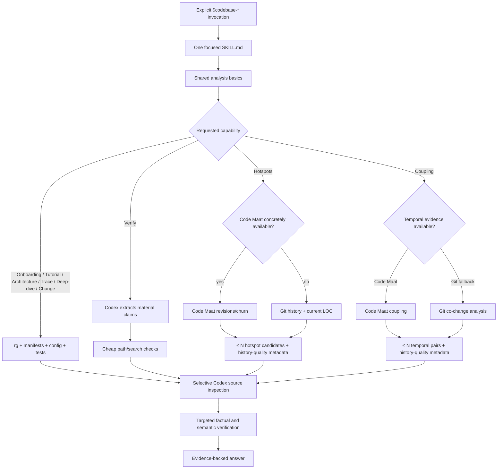

# Proposed V3 architecture

The smallest useful V3 is:

> Nine explicit Agent Skills, one concise shared analysis contract, and one narrow deterministic history helper used only by hotspots and temporal coupling.

It should not be an evidence platform, provider framework, architecture analyzer, call-graph engine, or tool-recommendation system.

This follows the runtime evidence: seven skills already derive their value almost entirely from Codex inspecting source and tests, while deterministic machinery materially helps only with historical candidate discovery and bounding context. The current general discovery, cache, schema, and verification layers add more structure than capability.

## 1. One-page conceptual architecture



Proposed physical shape:

```text
skills/
  codebase-onboarding/
  codebase-conversational-tutorial/
  codebase-architecture/
  codebase-trace/
  codebase-deep-dive/
  codebase-change/
  codebase-hotspots/
  codebase-coupling/
  codebase-verify/

shared/
  references/
    analysis-basics.md
    history-analysis.md
  scripts/
    history_candidates.py

scripts/
  validate_suite.py

tests/
  test_history_candidates.py
  test_suite_structure.py
```

The public architecture remains the nine explicit skills. Internally:

- `analysis-basics.md` contains safety, targeted inspection, uncertainty, source references, and final verification.
- `history-analysis.md` exists only for hotspots and coupling.
- `history_candidates.py` has two product-facing operations: hotspot candidates and temporal-coupling candidates.
- There is no generic evidence store or implicit cache.
- All semantic interpretation remains Codex work.

## 2. Minimal runtime flow for each skill

Classification legend:

- **Codex semantic reasoning**
- **Deterministic built-in/local operation**
- **Optional external tool**
- **Repository-native operation**

### `codebase-onboarding`

1. **Deterministic built-in/local operation:** Resolve the repository root, read applicable instructions, and inventory the top level, manifests, configuration, entry points, tests, and documented commands with `rg`/filesystem inspection.
2. **Codex semantic reasoning:** Infer purpose, runtime boundaries, central abstractions, state, integrations, and likely extension points.
3. **Deterministic built-in/local operation:** Search only for symbols, registrations, routes, and configuration needed to confirm the provisional model.
4. **Codex semantic reasoning:** Follow one or two representative flows and choose a high-value reading order.
5. **Repository-native operation:** Run an existing non-mutating help, test-listing, build-description, or focused test command only when it confirms the development workflow.
6. **Deterministic built-in/local operation:** Recheck cited paths and symbols.
7. **Codex semantic reasoning:** Deliver the mental model, repository map, workflows, reading order, and limitations.

No repository mapper or entry-point detector is justified: selecting meaningful boundaries and reading order is the semantic work users are asking Codex to perform.

### `codebase-conversational-tutorial`

1. **Codex semantic reasoning:** Adopt the requested audience and focus; otherwise assume a competent developer and proceed.
2. **Deterministic built-in/local operation:** Perform the same cheap repository reconnaissance as onboarding.
3. **Codex semantic reasoning:** Curate a small set of genuine core concepts—normally 5–10, but never as a quota.
4. **Deterministic built-in/local operation:** Locate the minimal source, tests, and configuration supporting each concept.
5. **Codex semantic reasoning:** Establish concept relationships and order them pedagogically: purpose before mechanics, foundations before dependants.
6. **Repository-native operation:** Run focused examples or tests only where execution materially improves the explanation.
7. **Deterministic built-in/local operation:** Validate paths, requested output links, and referenced symbols.
8. **Codex semantic reasoning:** Write the chapters, verify diagram semantics, and state omissions or uncertainty.

The tutorial-specific workflow should live in its `SKILL.md`; a separately loaded tutorial reference provides little progressive-disclosure benefit.

### `codebase-architecture`

1. **Deterministic built-in/local operation:** Inspect manifests, deployable units, runtime configuration, registrations, persistence configuration, and tests.
2. **Codex semantic reasoning:** Identify actual system boundaries, components, actors, communication mechanisms, state ownership, and dependency direction.
3. **Deterministic built-in/local operation:** Use targeted searches to confirm selected relationships.
4. **Codex semantic reasoning:** Trace a few representative cross-boundary flows and distinguish structural imports from meaningful architecture.
5. **Repository-native operation:** Use an already configured dependency or architecture-rule command only when repository scale creates a specific unresolved relationship.
6. **Codex semantic reasoning:** Verify each material diagram edge and report inferred boundaries as inferred.
7. **Codex semantic reasoning:** Produce the architectural mental model.

No deterministic architecture graph is needed. Removing one causes no failure because none exists today, and imports alone cannot establish the requested architecture.

### `codebase-trace`

1. **Codex semantic reasoning:** Resolve the named behavior. Ask only if several materially different behaviors match.
2. **Deterministic built-in/local operation:** Locate the concrete trigger using routes, commands, registrations, events, UI handlers, public APIs, or tests.
3. **Codex semantic reasoning:** Follow dispatch, transformations, decisions, state access, external calls, side effects, and result.
4. **Deterministic built-in/local operation:** Search definitions and callers for every important hop.
5. **Repository-native operation:** Run a focused test or existing trace/debug command where it confirms a disputed transition.
6. **Codex semantic reasoning:** Inspect relevant error, retry, transaction, authorization, and concurrency paths.
7. **Codex semantic reasoning:** Deliver the concise trace and verify every sequence-diagram message.

A generic call graph would add noise around dynamic registration, framework dispatch, data flow, and runtime configuration without proving the requested behavior.

### `codebase-deep-dive`

1. **Codex semantic reasoning:** Define the subsystem boundary and adjacent context.
2. **Deterministic built-in/local operation:** Locate its public API, constructors, configuration, callers, dependencies, state, and tests.
3. **Codex semantic reasoning:** Explain internals, lifecycle, invariants, state transitions, failure handling, concurrency, and extension points.
4. **Deterministic built-in/local operation:** Expand only through confirmed collaborators and downstream effects.
5. **Repository-native operation:** Run focused tests or configured diagnostics where behavior is otherwise ambiguous.
6. **Codex semantic reasoning:** Verify the public boundary, important callers, and lifecycle transitions.
7. **Codex semantic reasoning:** Deliver a bounded mental model and extension guidance.

No subsystem detector is warranted. “Subsystem” is often a domain or runtime boundary, not a directory pattern.

### `codebase-change`

1. **Codex semantic reasoning:** Restate the desired behavior and compatibility constraints; ask only for a missing product decision that changes the design.
2. **Deterministic built-in/local operation:** Locate the present entry points, APIs, schemas, state, configuration, events, clients, and tests.
3. **Codex semantic reasoning:** Trace current behavior and find the smallest coherent extension point.
4. **Deterministic built-in/local operation:** Search callers, implementations, fixtures, generated boundaries, and operational configuration for impact evidence.
5. **Repository-native operation:** Run test discovery, schema validation, type checking, or an existing build command only where it clarifies impact.
6. **Codex semantic reasoning:** Separate verified impact from likely impact; reason about compatibility, migration, rollout, rollback, and observability.
7. **Codex semantic reasoning:** Deliver an ordered implementation plan, test plan, risks, and open decisions.

No generic impact graph is justified. It would be incomplete for schemas, configuration, events, generated code, dynamic wiring, and operational behavior while sounding mechanically authoritative.

### `codebase-hotspots`

1. **Deterministic built-in/local operation:** Resolve Git history quality: HEAD, shallow state, history window, eligible commits, active span, bulk commits, rename activity, and excluded paths.
2. **Deterministic built-in/local operation:** Check only for a concrete Code Maat integration: a configured wrapper/executable or user-supplied native CSV.
3. **Optional external tool:** If Code Maat is concretely available, run or import its revisions/entity-churn analyses.
4. **Deterministic built-in/local operation:** Otherwise run the Git + current physical-LOC fallback.
5. **Deterministic built-in/local operation:** Apply generated/vendor exclusions, rename normalization, bulk-commit filtering, history-quality warnings, and deterministic ranking. Return at most roughly 10–20 candidates.
6. **Codex semantic reasoning:** Review the history-quality metadata and obvious construction/import/formatting confounders before trusting the ranking.
7. **Deterministic built-in/local operation:** Inspect selected candidates with focused `git log`/`git show`/`rg`.
8. **Codex semantic reasoning:** Inspect source, boundaries, callers, tests, responsibility, duplication, change surface, and repeated failure patterns.
9. **Repository-native operation:** Use existing tests or coverage only where they answer a concrete candidate question.
10. **Codex semantic reasoning:** Classify candidates as strong debt evidence, investigation-worthy, healthy high-change, or insufficient evidence.

A candidate must never be converted automatically into technical debt. The runtime audit demonstrates why: the current four-commit construction history ranks README and the helper highly without showing maintenance difficulty.

### `codebase-coupling`

1. **Codex semantic reasoning:** Resolve the requested scope. For a broad request, identify a small set of meaningful boundaries; for a named subject, keep the analysis anchored there.
2. **Deterministic built-in/local operation:** Assess Git history quality and concrete Code Maat availability.
3. **Optional external tool:** Prefer Code Maat coupling when already available and approved.
4. **Deterministic built-in/local operation:** Otherwise compute Git co-change pairs, excluding bulk commits and obvious generated/vendor noise, with rename normalization.
5. **Deterministic built-in/local operation:** Return a bounded list of temporal pairs with shared commits, endpoint revision counts, coupling definition, and limitations.
6. **Codex semantic reasoning:** For selected pairs, investigate four coupling classes separately:
   - temporal/evolutionary;
   - static;
   - logical/domain;
   - test.
7. **Deterministic built-in/local operation:** Use targeted searches for imports, calls, interfaces, messages, schemas, configuration, fixtures, mocks, and coordinated tests.
8. **Repository-native operation:** Use an existing dependency analyzer only when a concrete static-relationship gap remains. Do not recommend one for symmetry.
9. **Codex semantic reasoning:** Explain whether relationships are expected, potentially hidden, or unclear, and identify mismatches between temporal and visible source structure.
10. **Codex semantic reasoning:** Report only supported relationships and state when temporal evidence is insufficient.

Only temporal coupling benefits enough from deterministic preprocessing to justify bundled machinery. Static, logical, and test coupling are normally better handled through targeted inspection. The current implementation already relies on Codex for all three despite reserving schema vocabulary for them.

### `codebase-verify`

1. **Codex semantic reasoning:** Read the artifact and extract atomic material claims, including meaningful diagram nodes and edges.
2. **Codex semantic reasoning:** Classify each as existence, symbol/API, static relationship, runtime flow, architectural boundary, metric/history, or intent.
3. **Deterministic built-in/local operation:** Apply cheap checks with filesystem inspection, `rg`, Git, or the bounded history helper.
4. **Codex semantic reasoning:** Inspect definitions, callers, tests, configuration, and reachability for semantic claims.
5. **Repository-native operation:** Run a focused test, build, type check, or configuration validator only when the claim requires it.
6. **Codex semantic reasoning:** Assign `VERIFIED`, `INFERRED`, `UNKNOWN`, or `CONTRADICTED`.
7. **Codex semantic reasoning:** Deliver the claim table and highest-impact discrepancies without rewriting the artifact.

The existing lexical reference helper should be removed. It requires an intermediate JSON file and proves only lexical occurrence, not definitions, reachability, calls, or diagram semantics. Direct `rg` and source inspection are simpler.

## 3. Deterministic capabilities that should remain

V3’s helper should retain only these capabilities:

1. Git history parsing for hotspot and temporal-coupling analysis.
2. History-quality summary:
   - matched and eligible commit counts;
   - date span;
   - shallow status;
   - bulk commits excluded;
   - proportion of file touches excluded;
   - rename handling;
   - path exclusions.
3. Current tracked physical LOC for the Git hotspot fallback.
4. Rename-aware mapping to current repository paths.
5. Common generated/vendor/build filtering plus explicit user exclusions.
6. Bulk-commit exclusion for both hotspot frequency and coupling.
7. Deterministic hotspot ranking with tie-correct percentile/dense ranks.
8. Temporal pair calculation and bounded sorting/filtering.
9. Dedicated parsing of Code Maat hotspot and coupling output.
10. Minimal result validation: expected fields, numeric ranges, and normalized repository-relative paths.
11. Direct bounded JSON output.

These components earn their existence because removing them would force Codex to parse large Git logs, calculate co-change pairs, count LOC, handle renames, and rank candidates in model context. That would reduce reproducibility, increase tokens, and make large repositories impractical.

## 4. Capabilities that should be removed

| Remove | Reason |
|---|---|
| Generic ecosystem/tool discovery | It falsely classified this repository as C/C++ because it contains a Makefile and missed Code Maat entirely. Codex can inspect actual manifests and commands. |
| Generic tool recommendation matrix | There is no product requirement for recommending complexity, coverage, architecture, and dependency tools across every ecosystem. |
| Generic provider abstraction | There are exactly two historical paths: Code Maat and Git. Explicit branches are clearer. |
| Default evidence-store location | It exists solely to support caching and currently turns a missing cache into an error. |
| `cache-status` and persistent implicit cache | Git fallback is cheap enough to recompute, and the current cache adds stale-state and provider/parameter complexity. |
| Generic `query` command | Each analysis should return its bounded product-specific candidates directly. |
| Standalone generic `validate` command | Validation should occur inside the two producer paths. |
| Generic Evidence v1 observation ontology | Most subject and evidence types are unused scaffolding. |
| Per-observation provenance | Every observation currently repeats the same store metadata. |
| Reserved `static_dependency` and `test_coverage` evidence types | There are no producers or current consumers. |
| Component, directory, symbol, and component-pair subjects | Current producers emit only files and file pairs. |
| Default Git ownership observations | Useful in some investigations but not required for baseline hotspots or coupling. Codex can request focused author history when warranted. |
| Default Git churn observations | Not required by the Git+LOC fallback. Code Maat entity churn remains a provider-specific hotspot field. |
| Lexical `verify-references` helper | Direct search is simpler and semantic verification remains necessary. |
| Standalone repository metadata command | Metadata should be emitted with history results, not exposed as a separate subsystem. |
| Persisted “evidence ledger” terminology | This is model working context, not implemented infrastructure. |
| Automated architecture/call/concept/impact graphs | They do not exist and are not necessary to deliver the intended source-first skills. |

## 5. Capabilities that should be simplified

- Collapse `core.md`, `source-first.md`, and the generally applicable part of `verification.md` into one short `analysis-basics.md`.
- Collapse `tool-first.md`, `tool-providers.md`, and the relevant evidence instructions into `history-analysis.md`.
- Fold `tutorial-workflow.md` into the tutorial skill.
- Replace the multi-command helper with `hotspots` and `temporal-coupling` operations.
- Return final bounded candidates directly instead of producing a full store and then validating, querying, and ranking it.
- Replace generic evidence terminology with “history result,” “candidate,” and “limitation.”
- Use evidence statuses only where uncertainty is material rather than annotating every ordinary fact.
- Keep diagrams optional and semantic; stop implying there is diagram-generation or edge-verification machinery.
- Describe source-first/tool-first/evidence-first as working styles, not implemented runtime engines.

## 6. Evidence v1 recommendation

The existing Evidence v1 should not survive unchanged.

A normalized format remains useful only at the boundary between the two historical producers and the hotspot/coupling skills. Replace the generic observation store with two narrow result shapes:

```json
{
  "schema_version": 1,
  "analysis": "hotspots",
  "provenance": {
    "provider": "git",
    "provider_version": "git version ...",
    "repository_head": "...",
    "working_tree_dirty": true,
    "parameters": {},
    "generated_at": "..."
  },
  "history_quality": {
    "shallow": false,
    "matched_commits": 240,
    "eligible_commits": 221,
    "bulk_commits_excluded": 3,
    "renames_resolved": 8,
    "limitations": []
  },
  "metric_definitions": {
    "revisions": "eligible commits touching current file",
    "size": "current physical LOC",
    "score": "tie-correct revision-rank × size-rank"
  },
  "candidates": [
    {
      "path": "src/example.py",
      "revisions": 42,
      "size": 780,
      "score": 0.88
    }
  ]
}
```

The temporal form substitutes pair candidates and coupling metrics.

Exact evidence required by the current product:

- Hotspots:
  - current file path;
  - eligible revisions/change frequency;
  - physical LOC for Git, or explicitly named Code Maat size/churn value;
  - deterministic candidate score/ranks;
  - history-quality metadata.
- Temporal coupling:
  - file pair;
  - shared eligible commits;
  - each endpoint’s revision count where available;
  - coupling value, units, range, and definition;
  - history-quality metadata.

Not required:

- standalone ownership evidence;
- generic churn evidence;
- generic complexity;
- static dependencies;
- test coverage;
- component/directory/symbol subjects;
- semantic conclusions.

All candidates in one result share one producer and one run, so store-level provenance is sufficient. Per-candidate provenance should appear only if a result intentionally combines different runs or providers—which V3 should avoid.

## 7. Cache and provenance recommendation

Do not have an implicit persistent cache in V3.

For the Git fallback, recomputation is simpler and safer than cache identity, dirty-tree fingerprints, default paths, schema migrations, and cache-status orchestration.

For Code Maat:

- reuse temporary outputs within the same invocation;
- permit an explicit user-requested result file or user-supplied CSV;
- record sufficient store-level provenance when a result is saved;
- do not silently reuse it on a later invocation.

Minimal provenance:

- provider and version;
- repository HEAD;
- shallow and dirty state;
- analysis kind;
- history window;
- bulk/path/rename parameters;
- Code Maat input hash only when importing or persisting CSV;
- generation time;
- metric definitions.

Caching should be reconsidered only after real-repository measurement demonstrates that repeated Code Maat or Git analysis is a meaningful user cost. The current implementation pays substantial complexity for reuse that the audit did not demonstrate.

## 8. Code Maat integration recommendation

Code Maat remains the preferred optional external analyzer for behavioral hotspots and temporal coupling, but V3 should make support concrete.

Support exactly two integration modes:

1. An already installed/configured `code-maat` wrapper or explicitly supplied executable/JAR command.
2. User-supplied native Code Maat CSV.

For the first mode, the dedicated integration should:

- export the required Git log;
- invoke the exact hotspot or coupling analyses;
- capture provider version and arguments;
- normalize only the necessary candidate fields;
- return bounded results.

For CSV mode, validate:

- expected headers;
- numeric types and ranges;
- repository-relative paths;
- requested analysis type;
- input hash when results are persisted.

Do not:

- scan for a broad catalogue of ecosystem tools;
- silently install Code Maat, Java, Docker, or Clojure;
- pretend a CSV adapter means Code Maat is automatically available;
- force Code Maat and Git metrics into identical definitions.

If Code Maat is absent, use Git immediately. Recommend installation only when repository size/history or the user’s requested depth creates a concrete evidence gap.

## 9. Git fallback behavior

The Git fallback should be analysis-specific.

### Hotspots

1. Enumerate tracked current text files.
2. Exclude conventional generated/vendor/build/cache paths and explicit user patterns.
3. Parse history with rename detection.
4. Map historical names onto current files where unambiguous.
5. Exclude bulk changesets from revision counts as well as pair generation.
6. Report excluded commits and file touches.
7. Count eligible commits touching each current file.
8. Count current physical LOC.
9. Rank the two axes using tie-correct dense or percentile ranks.
10. Return only the highest candidates plus history-quality metadata.

### Temporal coupling

1. Apply the same history window, path filtering, bulk filtering, and rename handling.
2. Build co-change pairs only from eligible commits.
3. Filter by configurable minimum shared commits.
4. Calculate:

```text
shared_commits / min(left_revisions, right_revisions)
```

5. Return a bounded list ordered by shared support first and coupling strength second, or scoped to a requested subject.
6. Keep test files eligible; they may reveal real test coupling.
7. Prefer current files. Include deleted historical entities only when the user explicitly requests historical analysis.

### Quality handling

- No Git history: temporal analysis unavailable.
- Shallow history: results describe only the available clone.
- Fewer than two eligible commits: no pattern claim.
- A small number or short span of eligible commits: emit a low-sample warning, not a zero metric.
- Bulk construction/import commits: exclude from both analyses and report.
- Many excluded commits: warn that the remaining sample may be unrepresentative.
- Renames that cannot be resolved: report rather than silently split or merge histories.
- Bot, formatting, or migration confounders: expose enough commit information for Codex to inspect; do not classify commits from keywords alone.

## 10. Shared-reference structure

### `analysis-basics.md`

Loaded by all nine skills:

- resolve repository root and governing instructions;
- read-only default;
- privacy and installation permission;
- targeted `rg`, source, tests, configuration, and repository-native commands;
- `VERIFIED` / `INFERRED` / `UNKNOWN` / `CONTRADICTED`;
- real repository-relative paths and symbols;
- observations are not conclusions;
- final path, relationship, test, and diagram verification;
- follow contradictions and state limitations.

### `history-analysis.md`

Loaded only by hotspots and coupling:

- Code Maat → Git fallback selection;
- concrete helper commands;
- history-quality fields and confounders;
- metric definitions;
- provider-specific semantics;
- candidate limits;
- permission rule for optional Code Maat.

### Intentional repetition in each skill

Each independently invoked skill should still state:

- its exact input/scope;
- what makes it different from adjacent skills;
- its unique investigation checklist;
- its required output;
- its stopping boundary.

That repetition is necessary for reliable independent invocation.

### Duplication to eliminate

- repository discovery repeated across helper, core, strategy reference, and skill;
- final verification repeated in four places;
- provider selection repeated in hotspot, coupling, tool-first, provider guide, and helper;
- schema validation before and after every helper operation;
- per-observation plus store-level provenance;
- path/symbol checks through both `rg` and a helper.

## 11. What V3 deliberately does not automate

V3 does not attempt to automate:

- semantic architecture discovery;
- subsystem or domain-boundary detection;
- call-graph or runtime-flow reconstruction;
- tutorial concept selection or pedagogical ordering;
- change-impact completeness;
- logical/domain coupling;
- test coupling;
- technical-debt classification;
- defect classification from commit messages;
- document claim extraction;
- diagram semantic verification;
- generic ecosystem-tool recommendations;
- provider/plugin registration;
- report generation as a separate subsystem;
- automatic installation;
- source upload or remote analysis.

These are either better performed by Codex through targeted inspection or lack a demonstrated requirement.

## 12. Migration path from V2 to V3

The migration should use an Expand → Migrate → Contract sequence.

### Expand

- Preserve all nine skill names, explicit-only policies, and plugin manifests.
- Add the narrow history-result format and new hotspot/coupling operations alongside the existing CLI.
- Add characterization fixtures for:
  - construction/bulk commits;
  - sparse history;
  - renames;
  - generated/vendor paths;
  - ranking ties;
  - Code Maat malformed output;
  - hotspot and coupling result bounds.
- Keep old evidence/cache commands operational during this phase.

Gate: existing skills still work, and the V3 helper is independently usable.

### Migrate

1. Move `codebase-hotspots` to the direct hotspot-result path.
2. Compare V2 and V3 behavior on controlled fixtures and later on representative real repositories.
3. Move `codebase-coupling` to the temporal-result path.
4. Move all skills to the collapsed shared analysis reference.
5. Move tutorial guidance into its skill.
6. Remove all skill references to generic discovery, cache, query, generic evidence types, and the lexical verifier.

Gate: repository-wide search shows every skill uses the V3 paths, and behavioral/manual evaluation confirms that public skill intent remains intact.

### Contract

- Remove old `discover`, `repo-meta`, `default-store`, `cache-status`, `validate`, `query`, and `verify-references` commands.
- Remove the generic Evidence v1 schema and obsolete references.
- Remove cache and provider-framework tests.
- Update README and design documentation.
- Search for all old command names, evidence types, and reference filenames.
- Run structural validation and the focused helper suite.

Gate: no consumers remain and all nine skills remain installable and explicit-only.

This migration structure preserves the public product while allowing the internal helper contract to change safely.

## 13. Risks introduced by simplification

| Risk | Mitigation |
|---|---|
| Greater reliance on Codex’s source-navigation judgment | Strong per-skill scope/checklists, targeted verification, and explicit uncertainty. |
| No mechanical completeness guarantee for architecture or change impact | Do not claim completeness; inspect tests/configuration/registrations and report blind spots. |
| Code Maat reruns may be expensive without caching | Same-invocation reuse and explicit saved artifacts; add caching only after measured need. |
| Bulk-commit filtering can remove meaningful cross-cutting changes | Report every exclusion and make thresholds overridable. |
| Generated/vendor heuristics can miss repository-specific cases | Inspect repository declarations and permit explicit exclusions. |
| Rename normalization can be ambiguous | Report unresolved histories rather than fabricating continuity. |
| No bundled static graph may miss long-distance relationships | Use an already configured repository-native analyzer when a concrete gap appears. |
| Narrow history schema is less future-proof | Evolve it only alongside an actual producer and consumer. |
| Existing external users may rely on the documented helper CLI | Retain deprecated V2 commands through Expand/Migrate if such consumers exist. |
| Simplified verification may miss many repetitive references | Batch direct `rg` checks when necessary; restore a helper only if real audits demonstrate value. |

## 14. Expected benefits

### Token use

- History skills receive bounded candidates rather than full stores with repeated provenance.
- Source skills load one short common reference instead of multiple overlapping references.
- No generic tool catalogue enters context.
- Codex spends tokens on selected code and semantic interpretation, not parsing Git logs or framework terminology.

### Reliability

- Sparse, shallow, construction-heavy, bulk, generated, and rename-confounded histories become visible.
- Hotspot frequency and temporal pairs use consistent exclusions.
- No false confidence from unused evidence types or nominal provider abstraction.
- No stale implicit cache.
- No lexical symbol match presented as semantic verification.

### Maintainability

- One helper with two product operations.
- Two shared references instead of six.
- Fewer CLI commands, schema branches, validation paths, and tests.
- Adding a future capability requires demonstrating a producer, consumer, and concrete benefit before extending the schema.

### User predictability

- Each invocation has a clear workflow and stopping point.
- Seven skills honestly present themselves as Codex-guided source investigations.
- Hotspots and coupling clearly identify where deterministic history analysis contributes.
- Code Maat support corresponds to a real executable/import path.
- Metrics are consistently described as candidate signals, never conclusions.

## Retention test for current subsystems

These are the current subsystems V3 should retain, sometimes in simplified form. No other current subsystem earns architectural retention.

| Retained subsystem | What fails or becomes inefficient if removed? |
|---|---|
| Nine distinct `SKILL.md` entry points | User intent, scope, deliverables, and capability discovery collapse into an unpredictable mega-workflow. |
| Explicit-only agent policies | Expensive or broad analyses may run without user intent. |
| Plugin manifests | Installation and skill discovery break. |
| Shared safety/privacy/read-only rules | Skills become inconsistent about repository mutation, uploads, and tool installation. |
| Targeted source-inspection discipline | Codex is more likely to ingest broad file sets, waste context, and miss the requested boundary. |
| Evidence-status vocabulary | Inference and contradiction become harder to communicate consistently. |
| Semantic verification | Lexical/history observations could be overstated as runtime or architectural facts. |
| Tutorial pedagogy | Tutorial output degrades into onboarding or a file walkthrough. |
| Git history parsing | Codex must parse voluminous logs and calculate metrics unreliably in context. |
| Physical LOC for fallback hotspots | Git fallback loses its pragmatic size dimension and ranks only volatility. |
| Generated/vendor/bulk filtering | Candidate lists are dominated by non-maintained code and repository-construction events. |
| Rename handling | One logical file is split across names or attributed to the wrong current path. |
| Candidate ranking and limits | Large raw datasets enter context and candidate choice becomes ad hoc. |
| Code Maat integration | The declared preferred behavioral analyzer cannot actually be used consistently when available. |
| Store-level history provenance | Metrics cannot be tied to a provider, repository state, parameters, or limitations. |
| Repository-native commands | Claims about builds, tests, schemas, and configured dependency rules lose their strongest executable evidence. |
| Infrastructure and packaging tests | Git parsing, ranking, path validation, skill-set integrity, and installation metadata can regress silently. |
| Optional diagrams | Some architecture and trace relationships become materially harder to understand in prose alone. |

The central V3 decision is therefore not to eliminate deterministic analysis. It is to confine it to the two places where its removal has a clear cost: historical hotspot discovery and temporal coupling.
